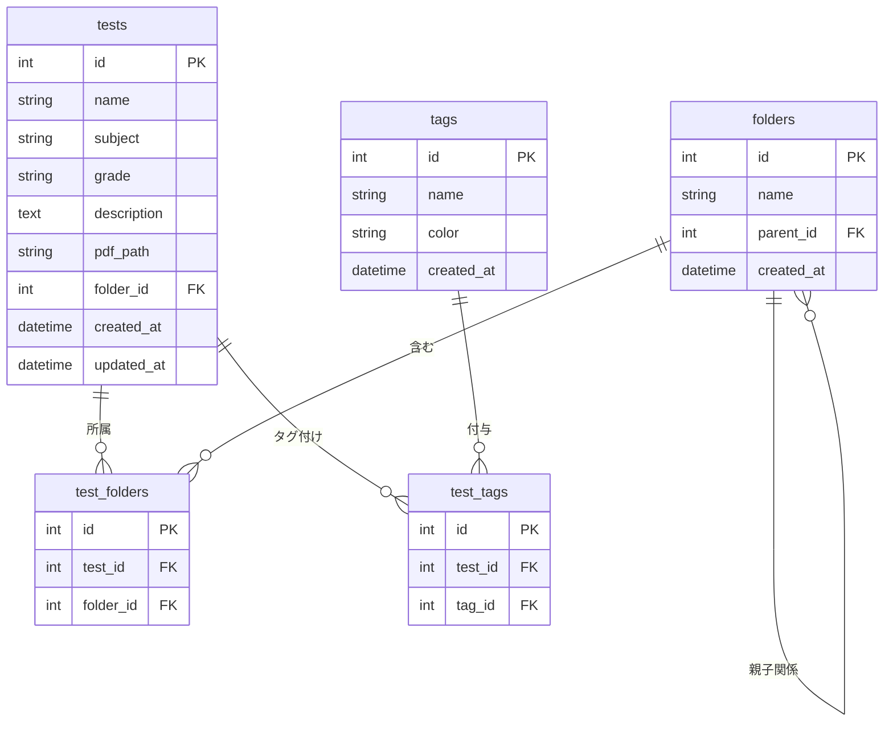

# テスト管理システム 機能一覧

このドキュメントは、テスト管理システムに実装されているすべての機能の詳細な一覧です。

**対象**: システム管理者、開発者、エンドユーザー  
**最終更新**: 2025 年 10 月 29 日  
**バージョン**: 1.0

---

## 📋 目次

1. [システム概要](#システム概要)
2. [テスト管理機能](#テスト管理機能)
3. [フォルダ管理機能](#フォルダ管理機能)
4. [タグ管理機能](#タグ管理機能)
5. [学年・教科管理機能](#学年教科管理機能)
6. [検索・フィルタ機能](#検索フィルタ機能)
7. [バックアップ・復元機能](#バックアップ復元機能)
8. [PDF 管理機能](#pdf管理機能)
9. [データベース管理機能](#データベース管理機能)
10. [UI/UX 機能](#uiux機能)

---

## システム概要

### 🎯 システムの目的

学校や塾で使用する定期テスト・単元テスト・模擬試験などの PDF ファイルを効率的に管理・検索するための Web アプリケーションです。

### 🏗️ 技術スタック

| カテゴリ         | 技術                                 |
| ---------------- | ------------------------------------ |
| フロントエンド   | Next.js 15.5.6, React 18, TypeScript |
| バックエンド     | Next.js App Router (API Routes)      |
| データベース     | SQLite (better-sqlite3)              |
| スタイリング     | Tailwind CSS                         |
| PDF ビューア     | PDF.js (Mozilla)                     |
| ファイルシステム | Node.js fs, multer                   |

### 📂 データモデル



---

## テスト管理機能

### 1. テスト登録機能

**機能 ID**: TEST-001  
**画面**: `/tests/new`  
**API エンドポイント**: `POST /api/tests`

#### 機能説明

新しいテストをシステムに登録します。

#### 入力項目

| 項目         | 必須 | 形式           | 説明                                       |
| ------------ | ---- | -------------- | ------------------------------------------ |
| テスト名     | ✅   | テキスト       | 例: "2023 年度 1 学期期末テスト"           |
| 学年         | ✅   | ドロップダウン | 中 1, 中 2, 中 3, 高 1, 高 2, 高 3, その他 |
| 教科         | ✅   | ドロップダウン | 数学, 英語, 国語, 理科, 社会, その他       |
| 説明         | ❌   | テキストエリア | テストの詳細情報                           |
| PDF ファイル | ✅   | ファイル       | .pdf 形式、最大 20MB                       |
| フォルダ     | ❌   | 複数選択       | 所属フォルダ(未選択時は「未分類」)         |
| タグ         | ❌   | 複数選択       | 任意のタグを複数選択可                     |

#### 処理フロー

```typescript
// 1. バリデーション
if (!name || !subject || !grade || !pdfFile) {
  return error("必須項目が入力されていません");
}

// 2. PDFファイルの保存
const testId = getNextTestId();
const uploadDir = `public/uploads/pdfs/test_${testId}`;
fs.mkdirSync(uploadDir, { recursive: true });
const pdfPath = `/uploads/pdfs/test_${testId}/${pdfFile.name}`;

// 3. データベースに登録
db.prepare(
  `
  INSERT INTO tests (name, subject, grade, description, pdf_path, folder_id, created_at, updated_at)
  VALUES (?, ?, ?, ?, ?, ?, datetime('now'), datetime('now'))
`
).run(name, subject, grade, description, pdfPath, folder_id);

// 4. フォルダ関連の登録
for (const folderId of folderIds) {
  db.prepare("INSERT INTO test_folders (test_id, folder_id) VALUES (?, ?)").run(
    testId,
    folderId
  );
}

// 5. タグ関連の登録
for (const tagId of tagIds) {
  db.prepare("INSERT INTO test_tags (test_id, tag_id) VALUES (?, ?)").run(
    testId,
    tagId
  );
}
```

#### 特殊処理

**未分類フォルダの自動割り当て**:

```typescript
// フォルダが選択されていない場合、自動的に「未分類」フォルダに割り当て
if (!folderIds || folderIds.length === 0) {
  let uncategorized = db
    .prepare("SELECT id FROM folders WHERE name = '未分類'")
    .get();
  if (!uncategorized) {
    db.prepare("INSERT INTO folders (name) VALUES (?)").run("未分類");
    uncategorized = db
      .prepare("SELECT id FROM folders WHERE name = '未分類'")
      .get();
  }
  folderIds = [uncategorized.id];
}
```

#### 成功時の動作

- テスト一覧画面(`/`)にリダイレクト
- 成功メッセージを表示

---

### 2. テスト編集機能

**機能 ID**: TEST-002  
**画面**: `/tests/[id]/edit`  
**API エンドポイント**: `PUT /api/tests/[id]`

#### 機能説明

既存のテスト情報を編集します。

#### 編集可能項目

- テスト名
- 学年
- 教科
- 説明
- PDF ファイル(差し替え可能)
- 所属フォルダ(複数選択可能)
- タグ(複数選択可能)

#### 処理フロー

```typescript
// 1. 既存データの取得
const test = db.prepare("SELECT * FROM tests WHERE id = ?").get(testId);

// 2. PDFファイルの処理
if (newPdfFile) {
  // 古いPDFファイルを削除
  const oldPdfDir = path.dirname(
    path.join(process.cwd(), "public", test.pdf_path)
  );
  fs.rmSync(oldPdfDir, { recursive: true, force: true });

  // 新しいPDFファイルを保存
  const newPdfPath = `/uploads/pdfs/test_${testId}/${newPdfFile.name}`;
  // ...保存処理
}

// 3. テスト情報の更新
db.prepare(
  `
  UPDATE tests 
  SET name = ?, subject = ?, grade = ?, description = ?, pdf_path = ?, folder_id = ?, updated_at = datetime('now')
  WHERE id = ?
`
).run(name, subject, grade, description, pdfPath, folder_id, testId);

// 4. フォルダ関連の更新
db.prepare("DELETE FROM test_folders WHERE test_id = ?").run(testId);
for (const folderId of folderIds) {
  db.prepare("INSERT INTO test_folders (test_id, folder_id) VALUES (?, ?)").run(
    testId,
    folderId
  );
}

// 5. タグ関連の更新
db.prepare("DELETE FROM test_tags WHERE test_id = ?").run(testId);
for (const tagId of tagIds) {
  db.prepare("INSERT INTO test_tags (test_id, tag_id) VALUES (?, ?)").run(
    testId,
    tagId
  );
}
```

#### 注意事項

- PDF ファイルを差し替えた場合、古いファイルは自動的に削除される
- フォルダ・タグの関連は一旦全削除してから再登録される

---

### 3. テスト削除機能

**機能 ID**: TEST-003  
**API エンドポイント**: `DELETE /api/tests/[id]`

#### 機能説明

テストをシステムから完全に削除します。

#### 削除される内容

1. テストのレコード(`tests`テーブル)
2. PDF ファイル(ファイルシステム)
3. フォルダ関連(`test_folders`テーブル) ※カスケード削除
4. タグ関連(`test_tags`テーブル) ※カスケード削除

#### 処理フロー

```typescript
// 1. テスト情報の取得
const test = db.prepare("SELECT * FROM tests WHERE id = ?").get(testId);

// 2. PDFファイルの削除
const pdfDir = path.dirname(path.join(process.cwd(), "public", test.pdf_path));
if (fs.existsSync(pdfDir)) {
  fs.rmSync(pdfDir, { recursive: true, force: true });
}

// 3. データベースから削除(関連データは自動削除)
db.prepare("DELETE FROM tests WHERE id = ?").run(testId);
// test_folders, test_tagsは外部キー制約のON DELETE CASCADEで自動削除
```

#### 確認ダイアログ

```javascript
if (confirm("このテストを削除してもよろしいですか?")) {
  // 削除処理
}
```

---

### 4. テスト一覧表示機能

**機能 ID**: TEST-004  
**画面**: `/` (トップページ)  
**API エンドポイント**: `GET /api/tests`

#### 機能説明

登録されているすべてのテストを一覧表示します。

#### 表示項目

| 列       | 内容                       | ソート | フィルタ            |
| -------- | -------------------------- | ------ | ------------------- |
| No.      | 通し番号                   | -      | -                   |
| テスト名 | テスト名称                 | ✅     | ✅ (キーワード検索) |
| 学年     | 学年                       | ✅     | ✅ (ドロップダウン) |
| 教科     | 教科名                     | ✅     | ✅ (ドロップダウン) |
| 所属     | フォルダ・タグ             | -      | ✅ (個別選択)       |
| 操作     | 編集・削除・PDF 表示ボタン | -      | -                   |

#### 表示形式

```typescript
// テーブル形式で表示
<table>
  <thead>
    <tr>
      <th>No.</th>
      <th>テスト名</th>
      <th>学年</th>
      <th>教科</th>
      <th>所属</th>
      <th>操作</th>
    </tr>
  </thead>
  <tbody>
    {tests.map((test, index) => (
      <tr key={test.id}>
        <td>{index + 1}</td>
        <td>{test.name}</td>
        <td>{test.grade}</td>
        <td>{test.subject}</td>
        <td>
          {/* フォルダ(未分類は除外) */}
          {test.folders
            .filter((f) => f.name !== "未分類")
            .map((f) => (
              <span className="badge">{f.name}</span>
            ))}
          {/* タグ */}
          {test.tags.map((t) => (
            <span className="badge">{t.name}</span>
          ))}
        </td>
        <td>
          <button onClick={() => viewPdf(test.id)}>PDF表示</button>
          <button onClick={() => editTest(test.id)}>編集</button>
          <button onClick={() => deleteTest(test.id)}>削除</button>
        </td>
      </tr>
    ))}
  </tbody>
</table>
```

#### 特殊表示ルール

**未分類フォルダの非表示**:

```typescript
// 「未分類」フォルダは画面に表示しない
test.folders.filter((folder) => folder.name !== "未分類");
```

**タグの色表示**:

```typescript
// タグは登録時に設定した色で表示
<span style={{ backgroundColor: tag.color }}>{tag.name}</span>
```

---

### 5. PDF 表示機能

**機能 ID**: TEST-005  
**コンポーネント**: `PdfViewer.tsx`

#### 機能説明

テストの PDF ファイルをブラウザ上で表示します。

#### 表示方法

**モーダルウィンドウ**:

```typescript
<div className="modal">
  <div className="modal-content">
    <iframe
      src={`/uploads/pdfs/test_${testId}/test.pdf`}
      width="100%"
      height="600px"
    />
    <button onClick={closeModal}>閉じる</button>
  </div>
</div>
```

**別タブで開く**:

```typescript
window.open(`/uploads/pdfs/test_${testId}/test.pdf`, "_blank");
```

#### 対応形式

- PDF 形式のみ
- ブラウザの標準 PDF ビューアを使用

---

## フォルダ管理機能

### 6. フォルダ作成機能

**機能 ID**: FOLDER-001  
**API エンドポイント**: `POST /api/folders`

#### 機能説明

テストを分類するためのフォルダを作成します。

#### 入力項目

| 項目       | 必須 | 形式           | 説明                          |
| ---------- | ---- | -------------- | ----------------------------- |
| フォルダ名 | ✅   | テキスト       | 例: "2023 年度", "中間テスト" |
| 親フォルダ | ❌   | ドロップダウン | 階層構造を作る場合に選択      |

#### 処理フロー

```typescript
// 1. 重複チェック
const existing = db.prepare("SELECT id FROM folders WHERE name = ?").get(name);
if (existing) {
  return error("同じ名前のフォルダが既に存在します");
}

// 2. フォルダ作成
db.prepare(
  `
  INSERT INTO folders (name, parent_id, created_at)
  VALUES (?, ?, datetime('now'))
`
).run(name, parent_id || null);
```

#### 階層構造の例

```
📁 2023年度
  ├─ 📁 1学期
  │   ├─ 📁 中間テスト
  │   └─ 📁 期末テスト
  ├─ 📁 2学期
  └─ 📁 3学期
📁 模擬試験
📁 単元テスト
📁 未分類 (システム自動作成)
```

---

### 7. フォルダ編集機能

**機能 ID**: FOLDER-002  
**API エンドポイント**: `PUT /api/folders/[id]`

#### 機能説明

フォルダ名や親フォルダを変更します。

#### 編集可能項目

- フォルダ名
- 親フォルダ(階層の変更)

#### 制限事項

- 「未分類」フォルダは編集不可
- 自分自身を親フォルダに設定することは不可

---

### 8. フォルダ削除機能

**機能 ID**: FOLDER-003  
**API エンドポイント**: `DELETE /api/folders/[id]`

#### 機能説明

フォルダを削除します。

#### 削除前チェック

```typescript
// 1. 子フォルダの存在チェック
const children = db
  .prepare("SELECT COUNT(*) as count FROM folders WHERE parent_id = ?")
  .get(folderId);
if (children.count > 0) {
  return error("子フォルダが存在するため削除できません");
}

// 2. 所属テストの処理
const tests = db
  .prepare(
    `
  SELECT test_id FROM test_folders WHERE folder_id = ?
`
  )
  .all(folderId);

// 削除されるフォルダのみに所属しているテストは「未分類」に移動
for (const { test_id } of tests) {
  const folderCount = db
    .prepare(
      `
    SELECT COUNT(*) as count FROM test_folders WHERE test_id = ?
  `
    )
    .get(test_id);

  if (folderCount.count === 1) {
    // このフォルダのみに所属 → 未分類に移動
    const uncategorized = db
      .prepare("SELECT id FROM folders WHERE name = '未分類'")
      .get();
    db.prepare(
      "UPDATE test_folders SET folder_id = ? WHERE test_id = ? AND folder_id = ?"
    ).run(uncategorized.id, test_id, folderId);
  } else {
    // 他のフォルダにも所属 → この関連のみ削除
    db.prepare(
      "DELETE FROM test_folders WHERE test_id = ? AND folder_id = ?"
    ).run(test_id, folderId);
  }
}

// 3. フォルダ削除
db.prepare("DELETE FROM folders WHERE id = ?").run(folderId);
```

#### 制限事項

- 「未分類」フォルダは削除不可

---

### 9. フォルダ階層表示機能

**機能 ID**: FOLDER-004

#### 機能説明

フォルダを階層構造で表示します。

#### 表示形式

```typescript
// 再帰的にフォルダツリーを構築
function buildFolderTree(
  parentId: number | null = null,
  level: number = 0
): JSX.Element {
  const folders = db
    .prepare(
      `
    SELECT * FROM folders WHERE parent_id ${
      parentId === null ? "IS NULL" : "= ?"
    }
  `
    )
    .all(parentId === null ? [] : [parentId]);

  return (
    <ul>
      {folders.map((folder) => (
        <li key={folder.id} style={{ marginLeft: `${level * 20}px` }}>
          <span>📁 {folder.name}</span>
          {buildFolderTree(folder.id, level + 1)}
        </li>
      ))}
    </ul>
  );
}
```

---

## タグ管理機能

### 10. タグ作成機能

**機能 ID**: TAG-001  
**API エンドポイント**: `POST /api/tags`

#### 機能説明

テストに付与するタグを作成します。

#### 入力項目

| 項目   | 必須 | 形式           | 説明                       |
| ------ | ---- | -------------- | -------------------------- |
| タグ名 | ✅   | テキスト       | 例: "重要", "復習", "苦手" |
| 色     | ✅   | カラーピッカー | 例: #FF5733, #3498DB       |

#### 処理フロー

```typescript
// 1. 重複チェック
const existing = db.prepare("SELECT id FROM tags WHERE name = ?").get(name);
if (existing) {
  return error("同じ名前のタグが既に存在します");
}

// 2. タグ作成
db.prepare(
  `
  INSERT INTO tags (name, color, created_at)
  VALUES (?, ?, datetime('now'))
`
).run(name, color);
```

#### 色の例

| タグ名 | 色コード | 表示 |
| ------ | -------- | ---- |
| 重要   | #FF0000  | 🔴   |
| 復習   | #FFA500  | 🟠   |
| 完璧   | #00FF00  | 🟢   |
| 苦手   | #0000FF  | 🔵   |

---

### 11. タグ編集機能

**機能 ID**: TAG-002  
**API エンドポイント**: `PUT /api/tags/[id]`

#### 機能説明

タグの名前や色を変更します。

#### 編集可能項目

- タグ名
- タグの色

---

### 12. タグ削除機能

**機能 ID**: TAG-003  
**API エンドポイント**: `DELETE /api/tags/[id]`

#### 機能説明

タグを削除します。

#### 削除時の動作

```typescript
// タグを削除すると、test_tagsの関連も自動削除される(ON DELETE CASCADE)
db.prepare("DELETE FROM tags WHERE id = ?").run(tagId);
// test_tagsテーブルからも自動的に削除される
```

---

## 学年・教科管理機能

### 13. 学年マスタ管理

**機能 ID**: GRADE-001  
**API エンドポイント**: `GET /api/grades`, `POST /api/grades`, `PUT /api/grades/[id]`, `DELETE /api/grades/[id]`

#### 機能説明

学年の選択肢を管理します。

#### デフォルト学年

- 中 1
- 中 2
- 中 3
- 高 1
- 高 2
- 高 3
- その他

#### 操作

- 学年の追加
- 学年の編集
- 学年の削除(使用されていない場合のみ)
- 表示順の変更

#### 処理例

```typescript
// 学年の追加
db.prepare("INSERT INTO grades (name, sort_order) VALUES (?, ?)").run("小6", 0);

// 削除前チェック
const count = db
  .prepare("SELECT COUNT(*) as count FROM tests WHERE grade = ?")
  .get("小6");
if (count.count > 0) {
  return error("この学年を使用しているテストが存在します");
}
```

---

### 14. 教科マスタ管理

**機能 ID**: SUBJECT-001  
**API エンドポイント**: `GET /api/subjects`, `POST /api/subjects`, `PUT /api/subjects/[id]`, `DELETE /api/subjects/[id]`

#### 機能説明

教科の選択肢を管理します。

#### デフォルト教科

- 数学
- 英語
- 国語
- 理科
- 社会
- その他

#### 操作

- 教科の追加(例: 情報、技術、家庭科)
- 教科の編集
- 教科の削除(使用されていない場合のみ)
- 表示順の変更

---

## 検索・フィルタ機能

### 15. キーワード検索機能

**機能 ID**: SEARCH-001  
**API エンドポイント**: `GET /api/tests?search=キーワード`

#### 機能説明

テスト名で部分一致検索を行います。

#### 検索対象

- テスト名(name)

#### 実装

```typescript
// API側
if (search) {
  query += " AND t.name LIKE ?";
  params.push(`%${search}%`);
}

// フロントエンド側
<input
  type="text"
  placeholder="テスト名で検索"
  value={searchKeyword}
  onChange={(e) => setSearchKeyword(e.target.value)}
/>;
```

#### 検索例

- 入力: "期末" → "2023 年度 1 学期期末テスト"などがヒット
- 入力: "数学" → "数学 単元テスト"などがヒット

---

### 16. 学年フィルタ機能

**機能 ID**: SEARCH-002  
**API エンドポイント**: `GET /api/tests?grade=中1`

#### 機能説明

学年でテストを絞り込みます。

#### 実装

```typescript
// API側
if (grade) {
  query += " AND t.grade = ?";
  params.push(grade);
}

// フロントエンド側
<select
  value={selectedGrade}
  onChange={(e) => setSelectedGrade(e.target.value)}
>
  <option value="">すべての学年</option>
  <option value="中1">中1</option>
  <option value="中2">中2</option>
  <option value="中3">中3</option>
  {/* ... */}
</select>;
```

---

### 17. 教科フィルタ機能

**機能 ID**: SEARCH-003  
**API エンドポイント**: `GET /api/tests?subject=数学`

#### 機能説明

教科でテストを絞り込みます。

#### 実装

```typescript
// API側
if (subject) {
  query += " AND t.subject = ?";
  params.push(subject);
}
```

---

### 18. フォルダフィルタ機能

**機能 ID**: SEARCH-004  
**API エンドポイント**: `GET /api/tests?folderId=1`

#### 機能説明

フォルダでテストを絞り込みます。**子孫フォルダも含めて検索**されます。

#### 階層検索の実装

```typescript
/**
 * 指定されたフォルダの子孫フォルダIDを全て取得(再帰的)
 */
function getDescendantFolderIds(folderId: number): number[] {
  const descendants: number[] = [];
  const children = db
    .prepare("SELECT id FROM folders WHERE parent_id = ?")
    .all(folderId);

  for (const child of children) {
    descendants.push(child.id);
    descendants.push(...getDescendantFolderIds(child.id)); // 再帰
  }

  return descendants;
}

// API側
if (folderId) {
  const descendantIds = getDescendantFolderIds(parseInt(folderId));
  descendantIds.push(parseInt(folderId)); // 自身も含める

  const placeholders = descendantIds.map(() => "?").join(",");
  query += ` AND EXISTS (
    SELECT 1 FROM test_folders tf 
    WHERE tf.test_id = t.id AND tf.folder_id IN (${placeholders})
  )`;
  params.push(...descendantIds);
}
```

#### 検索例

```
📁 2023年度 (id=1)
  ├─ 📁 1学期 (id=2)
  │   ├─ 📁 中間テスト (id=3) ← テストA, テストB
  │   └─ 📁 期末テスト (id=4) ← テストC
  └─ 📁 2学期 (id=5) ← テストD

フォルダID=1で検索 → テストA, B, C, Dすべて取得
フォルダID=2で検索 → テストA, B, C取得
フォルダID=3で検索 → テストA, B取得
```

---

### 19. タグフィルタ機能

**機能 ID**: SEARCH-005  
**API エンドポイント**: `GET /api/tests?tagId=1`

#### 機能説明

タグでテストを絞り込みます。

#### 実装

```typescript
// API側
if (tagId) {
  query += ` AND EXISTS (
    SELECT 1 FROM test_tags tt 
    WHERE tt.test_id = t.id AND tt.tag_id = ?
  )`;
  params.push(tagId);
}
```

---

### 20. 複合フィルタ機能

**機能 ID**: SEARCH-006  
**API エンドポイント**: `GET /api/tests?grade=中1&subject=数学&tagId=1&search=期末`

#### 機能説明

複数の条件を組み合わせて検索できます。

#### 組み合わせ例

```typescript
// 例: 「中1の数学で、"重要"タグが付いていて、テスト名に"期末"を含む」
GET /api/tests?grade=中1&subject=数学&tagId=1&search=期末

// すべての条件をANDで結合
WHERE grade = '中1'
  AND subject = '数学'
  AND EXISTS (SELECT 1 FROM test_tags WHERE tag_id = 1)
  AND name LIKE '%期末%'
```

---

## バックアップ・復元機能

### 21. データベースバックアップ機能

**機能 ID**: BACKUP-001  
**API エンドポイント**: `GET /api/backup/create`

#### 機能説明

データベースの完全なバックアップを作成します。

#### バックアップ方式

**VACUUM INTO を使用(重要)**:

```typescript
// ❌ 不完全な方法
fs.copyFileSync("data/tests.db", "backup.db");
// WALファイルの内容が含まれない

// ✅ 完全なバックアップ
const db = new Database("data/tests.db", { readonly: true });
db.exec(`VACUUM INTO '${backupPath}'`);
// WALファイルの内容も統合される
```

#### ファイル名形式

```
backup-2025-10-29T14-30-00.db
```

#### ダウンロード処理

```typescript
const backupBuffer = fs.readFileSync(backupPath);

return new NextResponse(backupBuffer, {
  headers: {
    "Content-Type": "application/octet-stream",
    "Content-Disposition": `attachment; filename="${filename}"`,
    "Content-Length": backupBuffer.length.toString(),
  },
});
```

---

### 22. データベース復元機能

**機能 ID**: BACKUP-002  
**API エンドポイント**: `POST /api/backup/restore`

#### 機能説明

バックアップファイルからデータベースを復元します。

#### 復元フロー

```typescript
// 1. バックアップファイルのアップロード
const formData = await request.formData();
const backupFile = formData.get("backup") as File;

// 2. ファイルの検証
const buffer = Buffer.from(await backupFile.arrayBuffer());
const header = buffer.slice(0, 16).toString("ascii");
if (!header.startsWith("SQLite format 3")) {
  return error("有効なSQLiteデータベースファイルではありません");
}

// 3. 現在のデータベースをバックアップ
const timestamp = new Date().toISOString().replace(/:/g, "-").split(".")[0];
fs.copyFileSync(dbPath, `data/tests-before-restore-${timestamp}.db`);

// 4. データベースを復元
fs.writeFileSync(dbPath, buffer);

// 5. 整合性チェック
const db = new Database(dbPath);
const integrity = db.prepare("PRAGMA integrity_check").get();
if (integrity.integrity_check !== "ok") {
  // ロールバック
  fs.copyFileSync(`data/tests-before-restore-${timestamp}.db`, dbPath);
  return error("復元に失敗しました");
}
```

#### 注意事項

- 復元前に自動的に現在のデータベースがバックアップされる
- 整合性チェックが失敗した場合は自動ロールバック
- 復元後は一度サーバーを再起動することを推奨

---

## PDF 管理機能

### 23. PDF ファイルアップロード機能

**機能 ID**: PDF-001  
**API エンドポイント**: `POST /api/upload`

#### 機能説明

PDF ファイルをサーバーにアップロードします。

#### 仕様

| 項目               | 制限                             |
| ------------------ | -------------------------------- |
| 最大ファイルサイズ | 20MB                             |
| 対応形式           | .pdf のみ                        |
| 保存先             | `public/uploads/pdfs/test_{id}/` |

#### アップロード処理

```typescript
// 1. ファイルサイズチェック
if (file.size > 20 * 1024 * 1024) {
  return error("ファイルサイズは20MB以下にしてください");
}

// 2. ファイル形式チェック
if (!file.name.endsWith(".pdf")) {
  return error("PDFファイルのみアップロード可能です");
}

// 3. 保存先ディレクトリ作成
const uploadDir = `public/uploads/pdfs/test_${testId}`;
if (!fs.existsSync(uploadDir)) {
  fs.mkdirSync(uploadDir, { recursive: true });
}

// 4. ファイル保存
const filePath = path.join(uploadDir, file.name);
const buffer = Buffer.from(await file.arrayBuffer());
fs.writeFileSync(filePath, buffer);
```

---

### 24. PDF ファイル削除機能

**機能 ID**: PDF-002

#### 機能説明

テスト削除時や PDF 差し替え時にファイルを削除します。

#### 削除処理

```typescript
// ディレクトリごと削除
const pdfDir = path.dirname(path.join(process.cwd(), "public", test.pdf_path));
if (fs.existsSync(pdfDir)) {
  fs.rmSync(pdfDir, { recursive: true, force: true });
}
```

---

## データベース管理機能

### 25. データベース初期化機能

**機能 ID**: DB-001  
**API エンドポイント**: `POST /api/init-db`

#### 機能説明

データベースを初期化します。

#### 初期化内容

```sql
-- テーブル作成
CREATE TABLE IF NOT EXISTS tests (...);
CREATE TABLE IF NOT EXISTS folders (...);
CREATE TABLE IF NOT EXISTS tags (...);
CREATE TABLE IF NOT EXISTS test_folders (...);
CREATE TABLE IF NOT EXISTS test_tags (...);

-- 未分類フォルダの作成
INSERT INTO folders (name) VALUES ('未分類')
ON CONFLICT DO NOTHING;

-- WALモードの設定
PRAGMA journal_mode = WAL;
```

---

### 26. データ整合性チェック機能

**機能 ID**: DB-002  
**スクリプト**: `check-db-integrity.mjs`

#### 機能説明

データベースの整合性をチェックします。

#### チェック項目

```javascript
// 1. folder_idがNULLのテスト
SELECT COUNT(*) FROM tests WHERE folder_id IS NULL;

// 2. 存在しないfolder_idを参照するテスト
SELECT COUNT(*) FROM tests t
WHERE NOT EXISTS (SELECT 1 FROM folders f WHERE f.id = t.folder_id);

// 3. test_foldersに関連がないテスト
SELECT COUNT(*) FROM tests t
WHERE NOT EXISTS (SELECT 1 FROM test_folders tf WHERE tf.test_id = t.id);

// 4. 孤立したtest_foldersレコード
SELECT COUNT(*) FROM test_folders tf
WHERE NOT EXISTS (SELECT 1 FROM tests t WHERE t.id = tf.test_id)
   OR NOT EXISTS (SELECT 1 FROM folders f WHERE f.id = tf.folder_id);

// 5. 孤立したtest_tagsレコード
SELECT COUNT(*) FROM test_tags tt
WHERE NOT EXISTS (SELECT 1 FROM tests t WHERE t.id = tt.test_id)
   OR NOT EXISTS (SELECT 1 FROM tags tg WHERE tg.id = tt.tag_id);
```

実行:

```bash
node check-db-integrity.mjs
```

---

## UI/UX 機能

### 27. レスポンシブデザイン

**機能 ID**: UI-001

#### 対応デバイス

- デスクトップ(1920px 以上)
- ラップトップ(1024px〜1919px)
- タブレット(768px〜1023px)
- モバイル(〜767px)

#### Tailwind CSS ブレークポイント

```css
/* モバイル優先 */
.container {
  padding: 1rem;
}

/* タブレット */
@media (min-width: 768px) {
  .container {
    padding: 2rem;
  }
}

/* デスクトップ */
@media (min-width: 1024px) {
  .container {
    padding: 3rem;
  }
}
```

---

### 28. モーダルウィンドウ機能

**機能 ID**: UI-002  
**コンポーネント**: `AdminModal.tsx`

#### 使用場面

- フォルダ作成・編集
- タグ作成・編集
- 学年・教科管理

#### 実装

```typescript
<AdminModal
  isOpen={isModalOpen}
  onClose={() => setIsModalOpen(false)}
  title="フォルダを追加"
>
  <form onSubmit={handleSubmit}>{/* フォーム内容 */}</form>
</AdminModal>
```

---

### 29. ローディング表示機能

**機能 ID**: UI-003

#### 表示タイミング

- API リクエスト中
- ファイルアップロード中
- データベース処理中

#### 実装

```typescript
const [isLoading, setIsLoading] = useState(false);

const handleSubmit = async () => {
  setIsLoading(true);
  try {
    await fetch("/api/tests", { method: "POST", body: formData });
  } finally {
    setIsLoading(false);
  }
};

return (
  <div>
    {isLoading && <div className="spinner">読み込み中...</div>}
    <button disabled={isLoading}>送信</button>
  </div>
);
```

---

### 30. エラーメッセージ表示機能

**機能 ID**: UI-004

#### エラー種別

| 種別   | 色  | アイコン | 例                             |
| ------ | --- | -------- | ------------------------------ |
| エラー | 赤  | ❌       | "必須項目が入力されていません" |
| 警告   | 黄  | ⚠️       | "ファイルサイズが大きいです"   |
| 成功   | 緑  | ✅       | "テストを登録しました"         |
| 情報   | 青  | ℹ️       | "処理中です"                   |

---

## 📊 機能統計

### 実装機能数

| カテゴリ           | 機能数 |
| ------------------ | ------ |
| テスト管理         | 5      |
| フォルダ管理       | 4      |
| タグ管理           | 3      |
| 学年・教科管理     | 2      |
| 検索・フィルタ     | 6      |
| バックアップ・復元 | 2      |
| PDF 管理           | 2      |
| データベース管理   | 2      |
| UI/UX              | 4      |
| **合計**           | **30** |

---

## 🔧 技術的な特徴

### 1. データ整合性の保証

- **外部キー制約**: すべての関連テーブルに FOREIGN KEY 制約を設定
- **ON DELETE CASCADE**: 親レコード削除時に子レコードも自動削除
- **NOT NULL 制約**: 必須カラムに NOT NULL 制約
- **UNIQUE 制約**: 重複防止(フォルダ名、タグ名など)

### 2. パフォーマンス最適化

- **WAL モード**: 読み取りと書き込みの並行処理が可能
- **インデックス**: 頻繁に検索されるカラムにインデックス作成
- **プリペアドステートメント**: SQL インジェクション防止とパフォーマンス向上

### 3. セキュリティ

- **パス検証**: ファイルパスのディレクトリトラバーサル攻撃を防止
- **ファイル検証**: アップロードファイルの形式とサイズをチェック
- **SQL インジェクション対策**: プリペアドステートメントを使用

---

## 📝 今後の拡張候補

### 優先度:高

- [ ] ユーザー認証機能(ログイン・ログアウト)
- [ ] アクセス権限管理(管理者・一般ユーザー)
- [ ] テストの複製機能
- [ ] 一括削除機能

### 優先度:中

- [ ] PDF のサムネイル表示
- [ ] テストの並び順カスタマイズ
- [ ] エクスポート機能(CSV、Excel)
- [ ] 統計・分析機能(学年別・教科別の集計)

### 優先度:低

- [ ] テストの印刷機能
- [ ] メモ・コメント機能
- [ ] 履歴管理機能(変更履歴の記録)
- [ ] 通知機能

---

## 📚 関連ドキュメント

- **[USER_MANUAL.md](./USER_MANUAL.md)** - エンドユーザー向け操作マニュアル
- **[DEVELOPER_GUIDE.md](./DEVELOPER_GUIDE.md)** - 開発者向けトラブルシューティングガイド
- **[specifications.md](./specifications.md)** - システム仕様書
- **[setup-current.md](./setup-current.md)** - セットアップ手順

---

© 2025 テスト管理システム開発チーム
